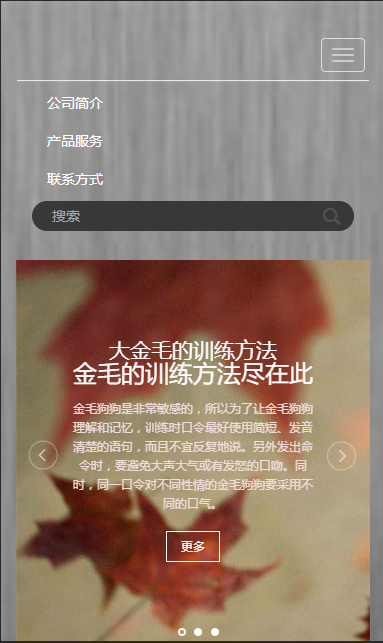
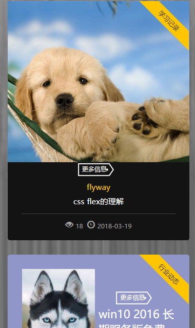
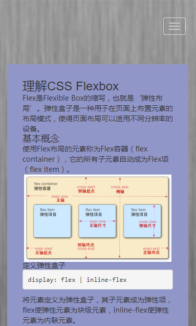

# flyway-blog
简单易用的blog
后台采用的node+ejs渲染，用了一点bootstrap。
前台基本就是bootstrap+jq了。

## 简介
就是一个博客。简单易用记录生活。写下来忘了的时候可以方便查看哈。

## 展示

## 产品安装和下载
- https://github.com/flyway-blog/flyway-blog/releases
- npm i flyway-blog

## 快速使用

- [使用文档](./doc/use/README.md)
- [二次开发文档](./doc/dev/README.md)

## 交流 & 提问
https://github.com/flyway-blog/flyway-blog/issues

## 关于作者
- [个人主页](http://120.78.175.231:8887/)

- 
如果觉得有用，打赏点呗。

一个刚毕业的本科大学生。记录自己的学习路线。